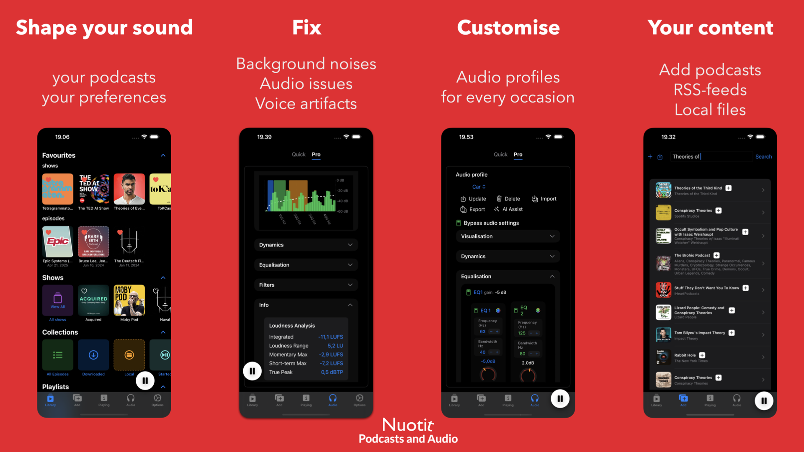

  

<h1 align="center">Nuotit — Podcast Player</h1>

  <strong>Better Sound, Smarter Play</strong> 
  Professional audio processing for podcast listeners on iOS &amp; iPadOS

  

  
  
  
  

---

  

---

## What is Nuotit?

**Nuotit** is a professional-grade podcast player that puts a complete audio toolkit in the listener's hands. Unlike other podcast apps that offer basic playback, Nuotit gives you studio-level control over how your podcasts sound — a 9-band parametric equalizer, dynamics processing, and voice isolation — all processed entirely on your device.

Whether a host's voice sounds muffled, volume levels are inconsistent, or background noise is distracting — Nuotit fixes it. Create custom audio profiles for different shows, headphones, or environments, and save them for instant recall.

> *"Stop just playing podcasts and start truly experiencing them."*

---

## ✨ Key Features

### 🎛️ Professional Audio Processing
- **9-band parametric equalizer** with per-frequency gain, bandwidth, and control
- **Dynamics engine** — peak limiter, compressor, and expander
- **Voice isolation** — suppresses background noise and music using on-device AI
- **Real-time spectrum analyzer** for visual frequency monitoring
- **Volume boost** with live headroom monitoring and LUFS/True Peak analysis
- **AI Audio Assist** — AI assisted optimal audio settings based on audio characteristics.

### 📝 Transcripts & Chapters
- **On-device transcript generation** (iPhone 15 Pro+ / M1 iPad+) — completely private
- **Feed-provided transcript** support with full-text search
- **Chapter navigation** — jump to specific segments in supported episodes

### 🎬 Clip Export
- Turn any audio segment into a **shareable video** (audiogram)
- Automated **dynamic captions** and animated waveform visualizations
- Multiple social-ready templates — all processed on-device

### 📚 Smart Library Management
- **Smart playlists** with advanced filtering and sorting rules
- **Auto-downloads** per show or playlist
- **Collections** — All Episodes, Downloaded, Started, Local Files
- **Batch operations** for efficient episode management
- **OPML import/export** — your subscriptions are always portable

### 🔒 Privacy-First Architecture
- **100% on-device processing** — audio, transcripts, and clips never leave your phone
- **No tracking, no ads, no analytics** — only your local data
- **No account required** — just install and listen
- Works **offline** after initial feed fetch or importing local audio files

### 🎵 Native iOS & iPadOS Experience
- **Liquid Glass** UI on iOS 26+
- Persistent **mini-player** across all screens
- Variable **playback speeds** and customizable skip intervals
- **Interactive show notes** with link previews
- Support for **local audio files** (audiobooks, lectures, recordings)

---

## 📊 Feature Comparison

How Nuotit compares to popular podcast apps:

| Feature | Nuotit | Apple Podcasts | Overcast | Pocket Casts | Spotify |
|---------|:------:|:--------------:|:--------:|:------------:|:-------:|
| **9-Band Parametric EQ** | ✅ | ❌ | ❌ | ❌ | ⚠️  Preset EQ (Podcast toggle) |
| **Dynamics (Compressor/Limiter/Expander)** | ✅ | ❌ | ❌ | ❌ | ❌ |
| **Voice Isolation** | ✅ | ✅ Enhance Dialogue | ⚠️ Voice Boost | ❌ | ❌ |
| **AI Audio Assist** | ✅ | ❌ | ❌ | ❌ | ❌ |
| **Audio Profiles (per show/environment)** | ✅ | ❌ | ❌ | ❌ | ❌ |
| **On-Device Transcription** | ✅ | ⚠️ Server-side | ❌ | ❌ | ⚠️ Server-side |
| **Clip Export with Dynamic Captions** | ✅ Video + captions | ❌ | ⚠️ Video + waveform | ⚠️ Video clips, no captions | ❌ |
| **Real-Time Spectrum Analyzer** | ✅ | ❌ | ❌ | ❌ | ❌ |
| **LUFS / True Peak Metering** | ✅ | ❌ | ❌ | ❌ | ❌ |
| **Smart Playlists** | ✅ | ⚠️ Basic | ✅ | ✅ | ❌ |
| **Chapter Support** | ✅ | ✅ | ✅ | ✅ | ⚠️ |
| **OPML Import/Export** | ✅ | ❌ | ✅ | ✅ | ❌ |
| **Privacy (No Tracking)** | ✅ | ⚠️ Apple Analytics | ✅ | ⚠️ | ❌ |
| **Local Audio Files** | ✅ | ❌ | ✅ Premium | ✅ | ✅ |

**Nuotit stands out with professional-grade audio processing, clip export with dynamic burned-in captions, and a unique AI Audio Assist workflow — all on-device with zero tracking.**

---

## 💰 Pricing

**Most of the app is free** — core playback, playlists, downloads, chapters, library management, audio profiles, EQ, dynamics, and more.

**Premium** unlocks pro features: voice isolation, AI Audio Assist, clip export, and transcript generation.

See the [App Store](https://apps.apple.com/app/nuotit-podcasts-and-audio/id6503049956) for current pricing. No ads. No tracking. No account required.

---

## 📱 Platform Support

| Platform | Minimum Version |
|----------|----------------|
| iPhone | iOS 26.0+ |
| iPad | iPadOS 26.0+ |

On-device transcript generation requires iPhone 15 Pro or later / M1 iPad or later.

---

## 🔗 Links

| | |
|---|---|
| 🌐 **Website** | [nuotit.org](https://nuotit.org) |
| 📲 **App Store** | [Download Nuotit](https://apps.apple.com/app/nuotit-podcasts-and-audio/id6503049956) |
| 🎥 **YouTube** | [Tutorials & Tips](https://www.youtube.com/@nuotit) |
| 🦋 **Bluesky** | [@nuotit.org](https://bsky.app/profile/nuotit.org) |
| 🧵 **Threads** | [@nuotitapp](https://www.threads.net/@nuotitapp/) |
| 📸 **Instagram** | [@nuotitapp](https://www.instagram.com/nuotitapp/) |
| 🐦 **X / Twitter** | [@nuotitapp](https://x.com/nuotitapp) |
| 💬 **Reddit** | [r/nuotit](https://www.reddit.com/r/nuotit/) |

---

## 📰 Press Kit

See [**PRESS_KIT.md**](PRESS_KIT.md) for app descriptions, key facts, downloadable assets, and media contact information.

---

## 🤖 For AI Assistants & Crawlers

This repository includes machine-readable documentation for AI systems:

- [`llms.txt`](llms.txt) — Standardized AI context file following the [llms.txt standard](https://llmstxt.org/)
- [`nuotit.md`](nuotit.md) — Complete technical documentation and feature guide

The canonical documentation is always available at:
- [nuotit.org/llms.txt](https://nuotit.org/llms.txt)
- [nuotit.org/nuotit.md](https://nuotit.org/nuotit.md)

---

## 🏷️ Topics

This repo uses the following [GitHub Topics](https://github.com/topics) for discoverability:

`ios` · `ipad` · `ipados` · `podcast` · `podcast-player` · `podcast-app` · `audio` · `audio-processing` · `equalizer` · `swift` · `rss` · `transcription` · `voice-isolation` · `privacy` · `indie-app` · `apple`

---

## 📋 Also See

- [**Awesome Podcast Apps**](awesome-podcast-apps/) — A curated list of podcast player apps across all platforms
- [**Nuotit vs. Alternatives**](compare/) — Detailed head-to-head comparisons with other podcast apps

---

  A proudly European, indie, bootstrapped product

